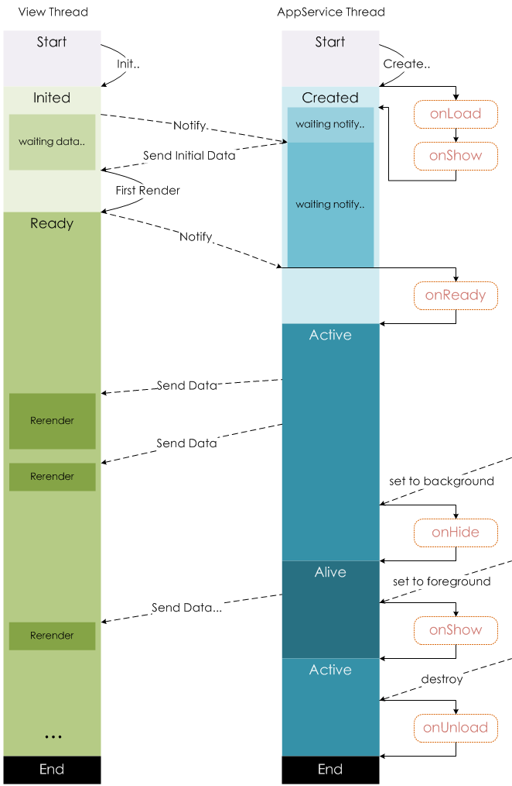

# App和页面的注册以及生命周期

> [wx.navigateTo](https://developers.weixin.qq.com/miniprogram/dev/api/route/wx.navigateTo.html) 

## 1.程序与页面
> [渲染层和逻辑层](https://developers.weixin.qq.com/miniprogram/dev/framework/quickstart/framework.html#渲染层和逻辑层) 

小程序包含一个描述整体程序的app和多个描述各自页面的page。

微信客户端是如何启动小程序的？

微信客户端在打开小程序之前，会把整个小程序的代码包下载到本地。然后通过入口 app.json 的 pages 就知道当前小程序的所有页面路径。接着就会把首页的代码装载进来，通过小程序底层的一些机制，就可以渲染出这个首页。

## 2.注册小程序
[注册小程序](https://developers.weixin.qq.com/miniprogram/dev/framework/app-service/app.html) 

- 每个小程序都需要在 app.js 中调用 App 方法注册小程序实例，绑定生命周期回调函数、错误监听和页面不存在监听函数等。
- 整个小程序只有一个 App 实例，是全部页面共享的。通过`getApp`方法可以获得这个实例。

注册小程序时一般做什么？
1. 判断小程序的进入场景，[场景值](https://developers.weixin.qq.com/miniprogram/dev/reference/scene-list.html) 。
2. 获取用户信息。
3. 设置全局数据 --- globalData。

## 3.注册页面
[注册页面](https://developers.weixin.qq.com/miniprogram/dev/framework/app-service/page.html) 

- 对于小程序中的每个页面，都需要在页面对应的 js 文件中进行注册，指定页面的初始数据、生命周期回调、事件处理函数等。
- 简单的页面使用Page构造器进行构造。
- 复杂的页面使用Component构造器进行构造。

小程序的一个页面是怎么写的呢？
- 前面已经介绍了，一个页面可能包括4种文件，微信客户端会先根据 `页面json` 配置生成一个界面，顶部的颜色和文字你都可以在这个 `页面json` 文件里边定义好。紧接着客户端就会装载这个页面的 `WXML` 结构和 `WXSS` 样式。最后客户端会装载 `JS`。
- 然后`Page`这个构造器就会生成一个页面。在生成页面的时候，小程序框架会把 `data` 数据和 `.wxml` 一起渲染出最终的结构。

注册页面时一般做什么？
1. 在生命周期函数中发送网络请求，从服务器获取数据。
2. 初始化一些数据，以方便被wxml引用展示。
3. 监听wxml中的事件，绑定对应的事件函数。
4. 其他一些监听（比如页面滚动、上拉刷新、下拉加载更多等）。

## 4.页面生命周期
> [页面生命周期](https://developers.weixin.qq.com/miniprogram/dev/framework/app-service/page-life-cycle.html) 

